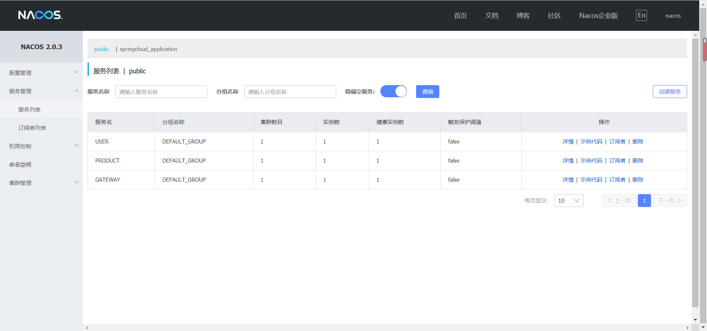

# springcloud_application_parent

这是一个简单的springcloud demo项目， 项目集成了springcloud alibaba的相关组件。

## 一. 依赖版本

本项目使用依赖版本

* springboot: 2.2.5.RELEASE
* springcloud: Hoxton.SR6
* springcloud alibaba: 2.2.1.RELEASE

## 二. features

### 1. 服务注册与发现 nacos

#### nacos

* 下载nacos服务端

  [点击下载linux安装包nacos](https://github.com/alibaba/nacos/releases/download/2.0.3/nacos-server-2.0.3.tar.gz)

* 运行nacos
  ```
    tar -zxvf nacos-server-2.0.3.tar.gz # 解压
    mv nacos-server-2.0.3 /usr/local/nacos 
    cd /usr/local/nacos
    bin/startup.sh -m standalone  #启动单机版
  ```
* 查看nacos界面
  ```
    http://192.168.22.126:8848/nacos
    账号： nacos
    密码： nacos
  ```
  
* 引入nacos依赖
  ```
  <dependency>
    <groupId>com.alibaba.cloud</groupId>
    <artifactId>spring-cloud-starter-alibaba-nacos-discovery</artifactId>
  </dependency>
  ```
* 添加spring配置
  ```
  server:
    port: 8080
  spring:
    application:
      name: USER
    cloud:
      nacos:
       server-addr: 127.0.0.1:8848
       username: nacos
       password: nacos
  ```
* 启动项目， 查看服务列表，成功注册

### 2. 配置中心 nacos

### 3. 服务调用 openfeign

### 4. 服务熔断以及限流 sentinel

### 5. 网关服务 gateway


