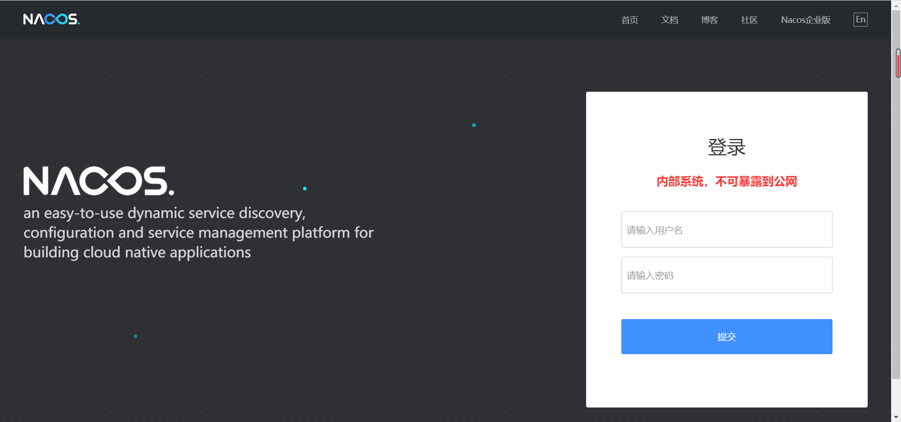
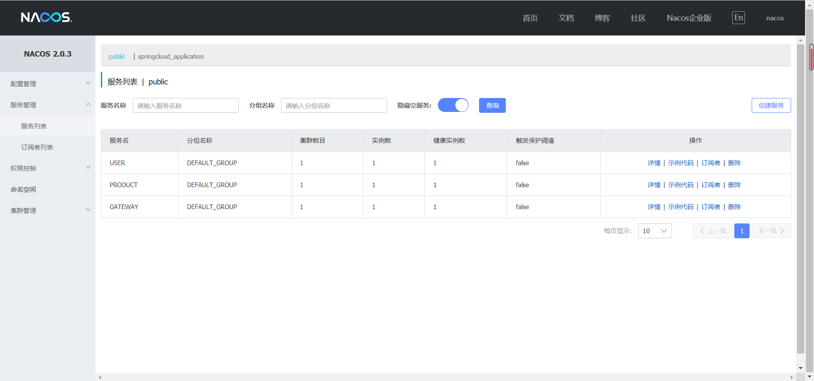
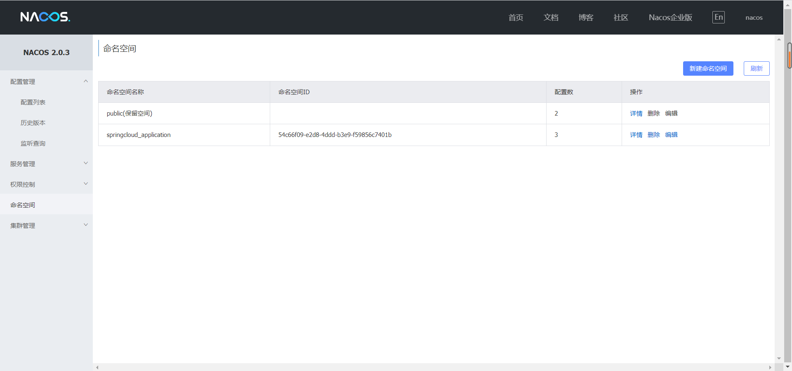
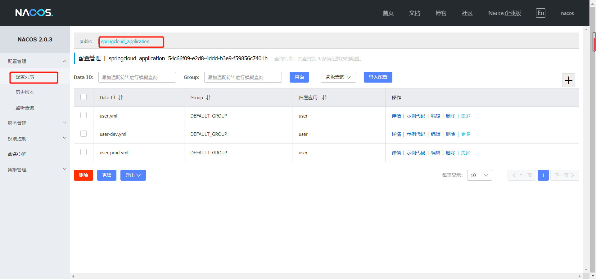
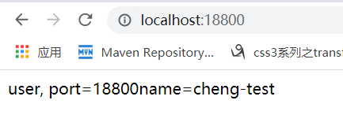
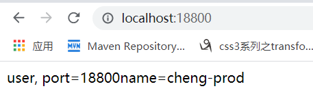

# springcloud_application_parent

这是一个简单的springcloud demo项目， 项目集成了springcloud alibaba的相关组件。

## 一. 依赖版本

本项目使用依赖版本

* springboot: 2.2.5.RELEASE
* springcloud: Hoxton.SR6
* springcloud alibaba: 2.2.1.RELEASE

## 二. features

### 1. 服务注册与发现 nacos

#### nacos

* 下载nacos服务端

  [点击下载linux安装包nacos](https://github.com/alibaba/nacos/releases/download/2.0.3/nacos-server-2.0.3.tar.gz)

* 运行nacos
  ```
    tar -zxvf nacos-server-2.0.3.tar.gz # 解压
    mv nacos-server-2.0.3 /usr/local/nacos 
    cd /usr/local/nacos
    bin/startup.sh -m standalone  #启动单机版
  ```
* 查看nacos界面
  ```
    http://192.168.22.126:8848/nacos
    账号： nacos
    密码： nacos
  ```
  
* 引入nacos依赖
`
    <dependency>
        <groupId>com.alibaba.cloud</groupId>
        <artifactId>spring-cloud-starter-alibaba-nacos-discovery</artifactId>
    </dependency>
`
* 添加spring配置
`
    spring:
        cloud:
            nacos:
                server-addr: 192.168.22.126:9981
                username: nacos
                password: nacos
            discovery:
                metadata:
                    verson: 1.0.3
                    active: ${spring.profiles.active}
                namespace: 54c66f09-e2d8-4ddd-b3e9-f59856c7401b
                group: user
        application:
            name: USER
        server:
            port: 18800  
`
* 启动项目， 查看服务列表，成功注册

### 2. 配置中心 nacos
* 配置文件
  * 新增命名空间，取名springcloud_application
  
  * 选择springcloud_application创建配置文件，user.yml, user-dev.yml，user-prod.yml
  
    
    * user.yml
    `
    logging:
        level:
            com.alibaba.nacos.client.config.impl: warn # 禁止频繁打印nacos心跳日志
            com.alibaba.nacos.client.naming: warn
    `
    
    * user-dev.yml
    `
        user:
            name: cheng-test
    `
    
    * user-prod.yml
    `
        user:
            name: cheng-prod
    `
    
* 引入依赖
  
  `
    <dependency>
        <groupId>com.alibaba.cloud</groupId>
        <artifactId>spring-cloud-starter-alibaba-nacos-config</artifactId>
    </dependency>
  `
* 代码
`
  package com.cheng;
  
  import org.springframework.beans.factory.annotation.Value;
  import org.springframework.boot.SpringApplication;
  import org.springframework.boot.autoconfigure.SpringBootApplication;
  import org.springframework.cloud.client.discovery.EnableDiscoveryClient;
  import org.springframework.cloud.context.config.annotation.RefreshScope;
  import org.springframework.web.bind.annotation.RequestMapping;
  import org.springframework.web.bind.annotation.RestController;
  
  /**
   * @author create by chengnian On 2021/9/19 15:00
   */
  @SpringBootApplication
  @RestController
  @RefreshScope  // 自动刷新注解
  @EnableDiscoveryClient // 开启注册发现
  public class UserApplication {
  
    @Value("${server.port}")
    private String port;
  
    @Value("${user.name}")
    private String name;
  
    public static void main(String[] args) {
    SpringApplication.run(UserApplication.class, args);
    }
  
    @RequestMapping
    public String get(){
    return "user, port=" + port + "name=" + name;
    }
  }
`
* spring配置文件
```yaml
spring:
  cloud:
    nacos:
      server-addr: 192.168.22.126:9981
      username: nacos
      password: nacos
      config:
        namespace: 54c66f09-e2d8-4ddd-b3e9-f59856c7401b # 指定namespace  即命名空间springcloud_application的id
        name: user # 文件名
        file-extension: yml # 文件后缀
        group: DEFAULT_GROUP # 文件分组
        refresh-enabled: true # 是否允许自动刷新
      discovery:
        metadata: # 元数据
          verson: 1.0.3
          active: ${spring.profiles.active}
        namespace: 54c66f09-e2d8-4ddd-b3e9-f59856c7401b
        group: user
  profiles:
    active: dev # profile激活
  application:
    name: USER
server:
  port: 18800
```

* 启动项目查看效果
  `
  http://localhost:18800
  `
  配置文件匹配规则为 
  [${springcloud.cloud.nacos.config.name}]-[${spring.profile.active}].[${springcloud.cloud.nacos.file-extension}]
  和[${springcloud.cloud.nacos.config.name}].[${springcloud.cloud.nacos.file-extension}]组合配置
  * 设置dev  加载user-dev.yml user.yml
    ```yaml
    profiles:
      active: dev
    ```
    
  * 设置prod  加载user-prod.yml user.yml
    ```yaml 
    profiles:
    active: prod
    ```
  

### 3. 服务调用 openfeign

### 4. 服务熔断以及限流 sentinel

### 5. 网关服务 gateway


